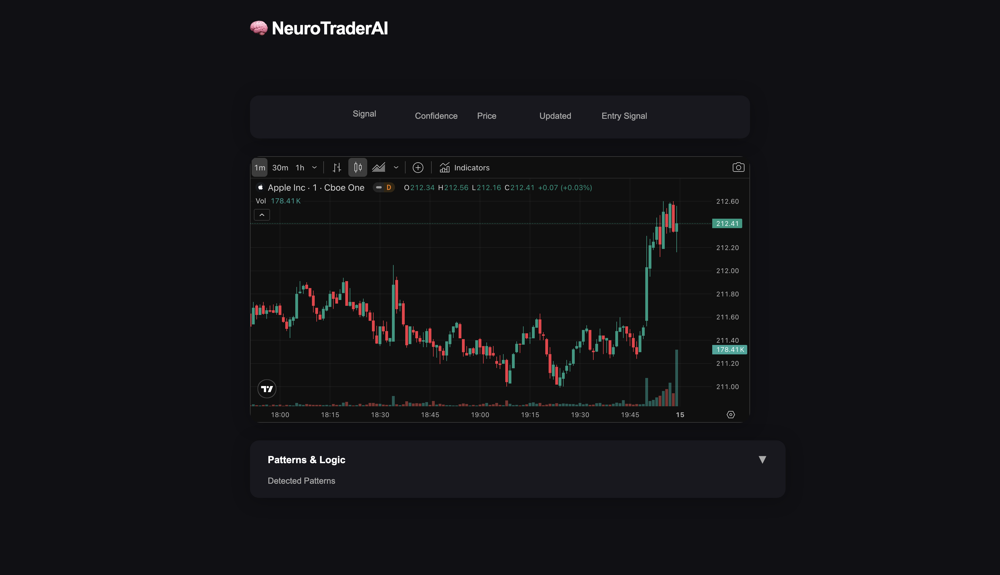

# 🧠 NeuroTraderAI



**NeuroTraderAI** is an intelligent trading signal bot and dashboard that mimics how an elite Wall Street trader might analyze markets. It combines real-time stock data, technical indicators, and pattern recognition to generate actionable BUY/SELL/HOLD alerts — all in a beautiful, modern web interface.

---

## 🚀 Features

- 📈 **Live TradingView Chart** with all the power of TradingView's UI
- 🧠 **AI-powered trading signals** (BUY/SELL/HOLD) with confidence scores
- 🔍 **Pattern recognition** and technical indicator analysis (RSI, MACD, EMA, candlestick patterns)
- 🖥️ **Modern, Figma-inspired dark UI**
- ⚡ **Fast backend** via Flask API
- 📤 Optional Discord alert integration
- 💾 Signal output includes:
  - Trade signal (🟢 BUY / 🔴 SELL / 🟡 HOLD)
  - Confidence score
  - Detected logic patterns
  - Price + timestamp

---

## 🛠️ Tech Stack


---

## ⚙️ How It Works

1. The dashboard loads a TradingView chart (default: AAPL, 1m)
2. The backend generates and updates trading signals for the current ticker
3. Signals, confidence, and detected patterns are displayed above and below the chart
4. (Optional) Discord alerts can be enabled for real-time notifications

---

## 🚦 Quick Start

### 1. Clone and Install
```bash
git clone https://github.com/yourname/NeuroTraderAI.git
cd NeuroTraderAI
pip install -r requirements.txt
```

### 2. Start the Backend
```bash
cd backend
python app.py
```

### 3. Start the Frontend
```bash
# From project root
yarn global add serve  # or npm install -g serve
serve -s frontend  # or use python3 -m http.server 1300
# Visit http://localhost:1300/frontend/index.html
```

---

## 📁 Project Structure

NeuroTraderAI/
├── backend/
│   ├── app.py           # Flask API server
│   ├── bot.py           # Core trading logic
│   ├── backend_utils.py # Indicator + save helpers
│   └── *.json / *.csv   # Generated signal/log files
│
├── frontend/
│   ├── index.html       # Web dashboard UI
│   ├── script.js        # JS to fetch and render signals
│   ├── screenshot.png   # UI screenshot (add this file)
│   └── data/            # Stores ticker JSON/CSV for frontend
│
└── requirements.txt     # Python dependencies

---

## 🤝 Contributing
Pull requests and issues are welcome! For major changes, please open an issue first to discuss what you would like to change.

---

## 📄 License
MIT
