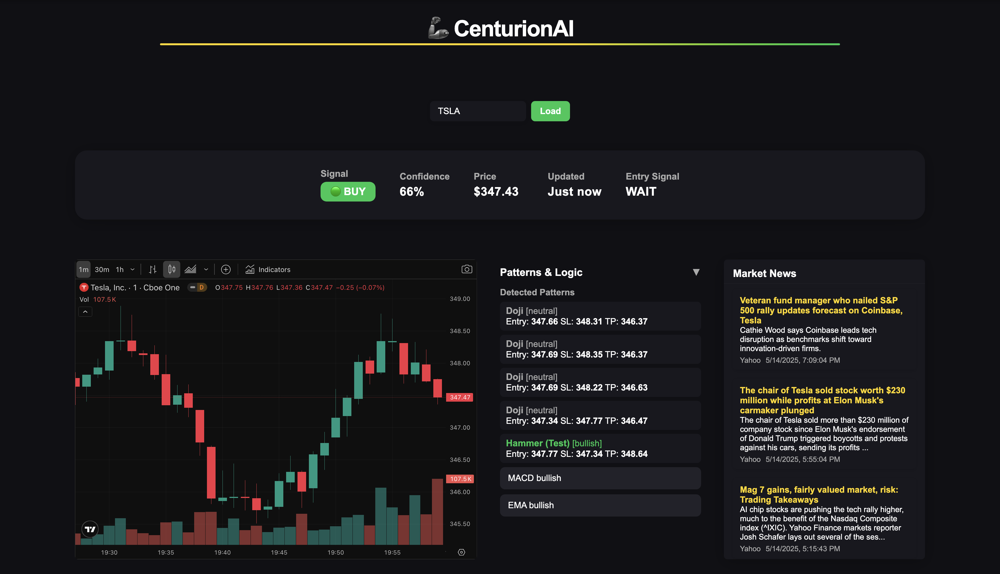

# 🦾 CenturionAI



**CenturionAI** brings discipline and strategic insight to trading, quietly monitoring the markets and analyzing patterns to deliver actionable signals. Drawing on the precision and vigilance of elite market guardians, it combines technical indicators, pattern recognition, and a modern dashboard to help you trade with confidence.

---

## 🚀 Features

- 📈 **Live TradingView Chart** with all the power of TradingView's UI
- 🧠 **AI-powered trading signals** (BUY/SELL/HOLD) with confidence scores
- 🔍 **Pattern recognition** and technical indicator analysis (RSI, MACD, EMA, candlestick patterns)
- 🖥️ **Modern, Figma-inspired dark UI**
- ⚡ **Fast backend** via Flask API
- 📤 Optional Discord alert integration
- 💾 Signal output includes:
  - Trade signal (🟢 BUY / 🔴 SELL / 🟡 HOLD)
  - Confidence score
  - Detected logic patterns
  - Price + timestamp

---

## 🛠️ Tech Stack


---

## ⚙️ How It Works

1. The dashboard loads a TradingView chart (default: AAPL, 1m)
2. The backend generates and updates trading signals for the current ticker
3. Signals, confidence, and detected patterns are displayed above and below the chart
4. (Optional) Discord alerts can be enabled for real-time notifications

---

## 🚦 Quick Start

### 1. Clone and Install
```bash
git clone https://github.com/yourname/CenturionAI.git
cd CenturionAI
pip install -r requirements.txt
```

### 2. Start the Backend
```bash
cd backend
python app.py
```

### 3. Start the Frontend
```bash
# From project root
yarn global add serve  # or npm install -g serve
serve -s frontend  # or use python3 -m http.server 1300
# Visit http://localhost:1300/frontend/index.html
```

---

## 📁 Project Structure

```plaintext
CenturionAI/
├── backend/
│   ├── app.py              # Flask API server
│   ├── bot.py              # Core trading logic
│   ├── backend_utils.py    # Indicator + save helpers
│   ├── pattern_engine.py   # Pattern recognition logic
│   └── __pycache__/        # Python cache files
│
├── frontend/
│   ├── index.html          # Web dashboard UI
│   ├── script.js           # JS to fetch and render signals
│   ├── style.css           # Dashboard styling
│   └── screenshot.png      # UI screenshot
│
├── requirements.txt        # Python dependencies
└── README.md               # Project documentation
```

---

## 🤝 Contributing
Pull requests and issues are welcome! For major changes, please open an issue first to discuss what you would like to change.

---

## 📄 License
MIT

---

## 🗺️ Feature Checklist

- [x] Advanced Candlestick Pattern Recognition (with entry/SL/TP)
- [ ] Order Block Detection
- [ ] Automated Support & Resistance Levels
- [ ] Breakout & Breakdown Strategy
- [ ] Trend Following with Moving Averages
- [ ] RSI/MACD Divergence Detection
- [ ] Volume Spike & Climax Bar Alerts
- [x] Automated Risk/Reward Calculation (for patterns)
- [ ] Order Flow & Tape Reading (Advanced)
- [ ] Backtesting & Signal Stats
- [x] Modern, Figma-inspired UI
- [x] Ticker input with chart/signal sync
- [ ] Chart Annotations (highlight candles, draw lines/boxes)
- [ ] Pattern Quality/Strength Scoring
- [ ] Multi-Timeframe Confluence
- [ ] Alerts/Automation
- [ ] Pattern Education (tooltips, info modals)

---

## 🚦 Prioritized Roadmap

1. Chart Annotations (highlight detected patterns on the chart)
2. Pattern Quality/Strength Scoring
3. Automated Support & Resistance Levels
4. Breakout & Breakdown Strategy
5. Trend Following with Moving Averages
6. RSI/MACD Divergence Detection
7. Order Block Detection
8. Volume Spike & Climax Bar Alerts
9. Multi-Timeframe Confluence
10. Backtesting & Signal Stats
11. Pattern Education (tooltips, info modals)
12. Alerts/Automation
13. Order Flow & Tape Reading (Advanced)
